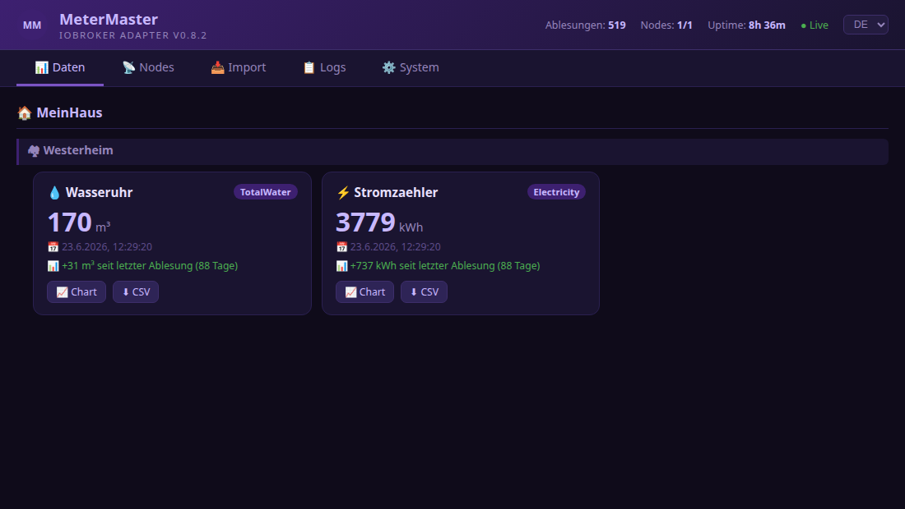
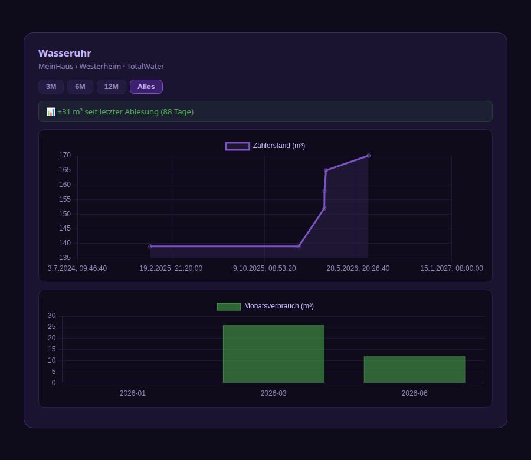
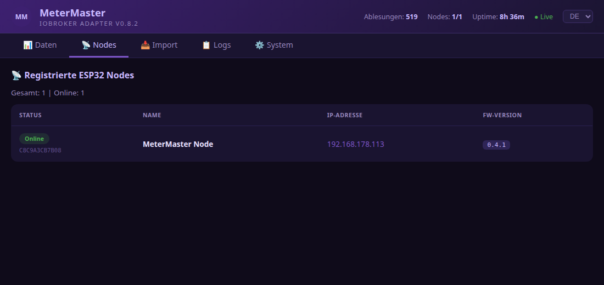
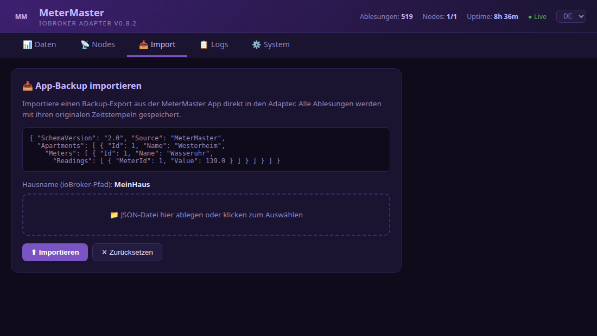
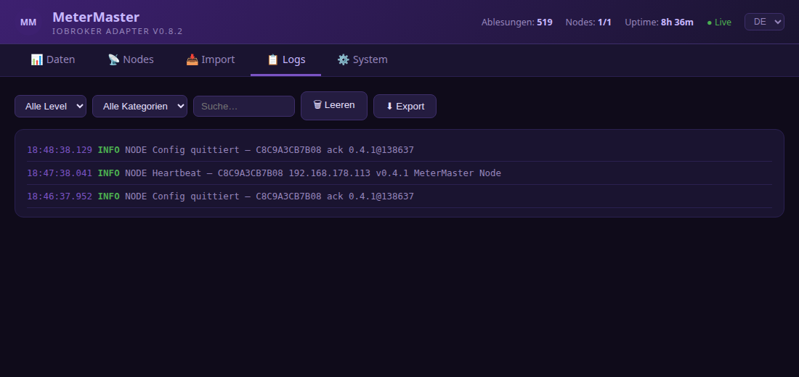
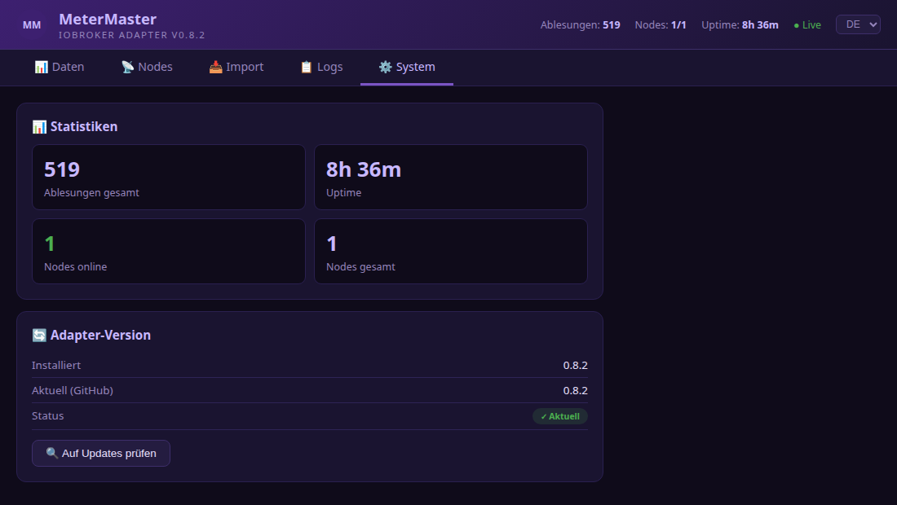

# ioBroker MeterMaster Adapter

[](https://github.com/MPunktBPunkt/iobroker.metermaster)

[](https://github.com/MPunktBPunkt/iobroker.metermaster)
[](https://github.com/MPunktBPunkt/iobroker.metermaster/blob/main/LICENSE)
[](https://nodejs.org)

Empfängt Zählerablesungen von der **[MeterMaster Android-App](https://play.google.com/store/apps/details?id=com.propertymanagement.metermaster)**, speichert sie als ioBroker-Datenpunkte und verwaltet **ESP32 Display-Nodes** für die Anzeige von Zählerwerten auf OLED-Displays. Quellcode: [GitHub](https://github.com/MPunktBPunkt/MeterMaster).

---

## Features

- 📡 **HTTP-Empfänger** – nimmt Ablesungen direkt von der App entgegen
- 🏷️ **Automatische Datenpunkte** – States werden beim ersten Sync selbstständig angelegt
- 🕐 **Korrekter Zeitstempel** – `ts` des States entspricht dem echten Ablesedatum
- 📈 **Historie** – jeder Zähler hält einen vollständigen `readings.history`-Array
- 🔐 **Basic Auth** – optionaler Benutzername/Passwort-Schutz
- 🌐 **Web-UI** – eingebauter Browser-Viewer mit 5 Tabs (Daten, Nodes, Import, Logs, System)
- 📊 **Charts & CSV** – Verlaufsdiagramme, Monatsverbrauch und CSV-Export pro Zähler
- 🌍 **DE/EN** – Sprachumschalter in der Web-UI
- 📥 **Import** – App-Backup (Schema 2.0) direkt über die Web-UI einspielen
- 📡 **ESP32 Node-Verwaltung** – registrierte Display-Nodes anzeigen und konfigurieren
- 🎛️ **Fernsteuerung** – Zähler und LED der ESP32-Nodes direkt aus der Web-UI steuern

---

## Screenshots

Die eingebaute Web-UI bietet fünf Tabs — hier ein Überblick:

| | |
|---|---|
| **📊 Daten** – Zählerkarten mit Verbrauchs-KPI, Verlauf, Chart & CSV |  |
| **📈 Chart-Modal** – Zählerstand (lineare Zeitachse) & Monatsverbrauch |  |
| **📡 Nodes** – ESP32-Status, IP, Firmware |  |
| **📥 Import** – App-Backup per Drag & Drop |  |
| **📋 Logs** – Echtzeit-Log mit Filter & Export |  |
| **⚙️ System** – Statistiken & Versionscheck |  |

---

## Installation

### Option A – direkt von GitHub (empfohlen)

```bash
iobroker add https://github.com/MPunktBPunkt/iobroker.metermaster
iobroker start metermaster
```

### Option B – manuell (ohne Internet / Offline)

```bash
mkdir -p /opt/iobroker/node_modules/iobroker.metermaster
# Dateien kopieren: main.js  io-package.json  package.json  admin/
cd /opt/iobroker/node_modules/iobroker.metermaster
npm install
cd /opt/iobroker
iobroker add metermaster
iobroker start metermaster
```

Firewall falls nötig: `sudo ufw allow 8089/tcp`

Vollständige Installationsanleitung: [INSTALLATION.md](INSTALLATION.md)

---

## Instanz konfigurieren

Nach der Installation → ioBroker Admin → **Adapter → MeterMaster** → Instanz anlegen:

| Einstellung | Standard | Beschreibung |
|---|---|---|
| HTTP Port | `8089` | Port auf dem der Adapter lauscht |
| Benutzername | `metermaster` | Basic-Auth Username |
| Passwort | – | Basic-Auth Passwort |
| Ausführliches Logging | ✅ | DEBUG-Einträge im Log-Viewer |
| Log-Puffer | `500` | Max. gespeicherte Log-Einträge |
| Historie aufbewahren | `0` | 0 = unbegrenzt |

---

## MeterMaster Android-App

Zähler erfassen und mit ioBroker synchronisieren — die passende App:

| | |
|---|---|
| **Google Play** | [**MeterMaster**](https://play.google.com/store/apps/details?id=com.propertymanagement.metermaster) — App installieren, Zähler ablesen und an den Adapter senden |
| **GitHub** | [**MPunktBPunkt/MeterMaster**](https://github.com/MPunktBPunkt/MeterMaster) — Quellcode, APK-Build und Anleitung |

[](https://play.google.com/store/apps/details?id=com.propertymanagement.metermaster)

---

## MeterMaster App konfigurieren

**Einstellungen → ioBroker → MeterMaster Adapter:**

| Feld | Wert |
|---|---|
| ioBroker aktivieren | ✅ |
| IP / Hostname | IP des ioBroker-Servers |
| Adapter-Port | `8089` |
| Benutzername | wie im Adapter konfiguriert |
| Passwort | wie im Adapter konfiguriert |

„Verbindung testen" → sollte `MeterMaster-Adapter erreichbar ✓` zurückgeben.

---

## Web-UI

Aufrufbar ohne Passwort:

```
http://{ioBroker-IP}:8089/
```

| Tab | Inhalt |
|---|---|
| 📊 **Daten** | Alle empfangenen Zähler, gegliedert nach Haus/Wohnung, mit Verlauf, Chart-Modal und CSV-Export |
| 📡 **Nodes** | Registrierte ESP32-Nodes: Status, IP-Link, FW-Version, Zähler-Dropdown, LED-Steuerung |
| 📥 **Import** | App-Backup (JSON Schema 2.0) per Drag & Drop einspielen |
| 📋 **Logs** | Echtzeit-Log mit Filter, Auto-Scroll, Export |
| ⚙️ **System** | Statistiken, GitHub-Versionscheck, Ein-Klick-Update |

Screenshots: siehe [Screenshots](#screenshots) oben.

---

## ESP32 Display-Node

Der Adapter unterstützt den [MeterMaster ESP32 Node](https://github.com/MPunktBPunkt/esp32.MeterMaster) als OLED-Display-Companion.

### Ablauf
1. ESP32 sendet Heartbeat alle 60 s: `POST :8089/api/register`
2. Adapter legt `metermaster.0.nodes.{MAC}.*` States automatisch an
3. ESP32 pollt alle 15 s: `GET :8089/api/nodes/{MAC}/config`
4. Adapter liefert Config und optionale Sofortbefehle (cmd)

### Nodes-Tab
- Online/Offline-Badge (grün wenn Heartbeat < 120 s)
- IP als klickbarer Link → öffnet ESP32 Web-UI
- Zähler-Dropdown: Zähler zuweisen → ESP32 übernimmt beim nächsten Poll
- LED-Buttons: 🔴 Ein / ⚫ Aus → sofortiger Befehl via cmd-State

---

## Angelegte Datenpunkte

```
metermaster.0.
├── info.connection        bool    Adapter verbunden
├── info.lastSync          string  ISO-8601 Zeitpunkt letzter Sync
├── info.readingsReceived  number  Ablesungen gesamt
│
├── {Haus}/{Wohnung}/{Zähler}/
│   ├── readings.latest      number  Letzter Messwert (ts = Ablesedatum)
│   ├── readings.latestDate  string  ISO-8601 Datum
│   ├── readings.history     string  JSON-Array aller Ablesungen
│   ├── name                 string
│   ├── unit                 string
│   └── typeName             string
│
└── nodes/{MAC}/
    ├── ip          string  IP-Adresse des ESP32
    ├── name        string  Gerätename
    ├── version     string  Firmware-Version
    ├── lastSeen    number  Timestamp letzter Heartbeat (ms)
    ├── config      string  JSON-Config (Adapter schreibt, ESP32 liest)
    ├── configAck   string  Quittierung durch ESP32
    └── cmd         string  Sofortbefehl (Adapter schreibt, ESP32 liest+löscht)
```

---

## HTTP API

### Ohne Authentifizierung

| Methode | Pfad | Beschreibung |
|---|---|---|
| GET | `/` | Web-UI |
| GET | `/api/version` | Version + GitHub-Check |
| GET | `/api/stats` | Statistiken (Ablesungen, Uptime, Nodes) |
| GET | `/api/data` | Alle gecachten Ablesungen |
| GET | `/api/logs` | Log-Buffer (mit `?level=&category=&text=` Filter) |
| GET | `/api/nodes` | Alle registrierten ESP32-Nodes |
| GET | `/api/discover` | Bekannte Zähler-State-IDs |
| POST | `/api/register` | ESP32 Heartbeat (kein Auth nötig) |
| POST | `/api/update` | Adapter-Update starten |

### Mit Basic Auth

| Methode | Pfad | Beschreibung |
|---|---|---|
| GET | `/api/ping` | Verbindungstest |
| POST | `/api/reading` | Einzelne Ablesung speichern |
| POST | `/api/readings` | Batch-Ablesungen speichern |
| POST | `/api/import` | App-Backup importieren |
| GET | `/api/nodes/{MAC}/config` | Config für ESP32 abrufen |
| POST | `/api/nodes/{MAC}/config` | Config für ESP32 setzen |
| POST | `/api/nodes/{MAC}/configAck` | Config-Quittierung empfangen |
| POST | `/api/nodes/{MAC}/cmd` | Sofortbefehl senden (LED, Zähler) |

### Beispiel: Einzelne Ablesung

```
POST http://host:8089/api/reading
Authorization: Basic base64(user:passwort)
Content-Type: application/json

{
  "house":       "MeinHaus",
  "apartment":   "Westerheim",
  "meter":       "Warmwasser",
  "value":       128.75,
  "unit":        "m³",
  "typeName":    "HotWater",
  "readingDate": "2024-02-12T09:30:00.000Z"
}
```

### Beispiel: Sofortbefehl an ESP32

```
POST http://host:8089/api/nodes/C8C9A3CB7B08/cmd
Authorization: Basic base64(user:passwort)
Content-Type: application/json

{ "ledOn": true }
```

---

## Update

### Über die Web-UI (empfohlen)
`http://IP:8089/` → Tab **⚙️ System** → „Auf Updates prüfen" → „Update installieren"

### Kommandozeile

```bash
iobroker url https://github.com/MPunktBPunkt/iobroker.metermaster
iobroker restart metermaster.0
```

**Beispiel-Output (Ubuntu LXC):**

```
root@IoBroker:~# iobroker url https://github.com/MPunktBPunkt/iobroker.metermaster
install MPunktBPunkt/iobroker.metermaster#<commit-hash>
NPM version: 11.x.x
Installing MPunktBPunkt/iobroker.metermaster... (System call)
changed 1 package in 11s
upload [1] metermaster.admin .../admin/jsonConfig.json
upload [0] metermaster.admin .../admin/metermaster.svg
Updating objects from io-package.json for adapter "metermaster" with version "0.8.2"
Update "system.adapter.metermaster.0"

root@IoBroker:~# iobroker restart metermaster.0
The adapter "metermaster.0" was started.

root@IoBroker:~# cat /opt/iobroker/node_modules/iobroker.metermaster/package.json | grep '"version"'
  "version": "0.8.2",
```

> **Hinweis:** Die Meldung `[DEP0169] DeprecationWarning: url.parse()` ist harmlos und kommt vom ioBroker-CLI selbst, nicht vom Adapter.

### Version prüfen nach Update

```bash
sed -n '9p' /opt/iobroker/node_modules/iobroker.metermaster/main.js
# Erwartet: const CURRENT_VERSION = '0.8.2';
```

---

## Lizenz

MIT © MPunktBPunkt
